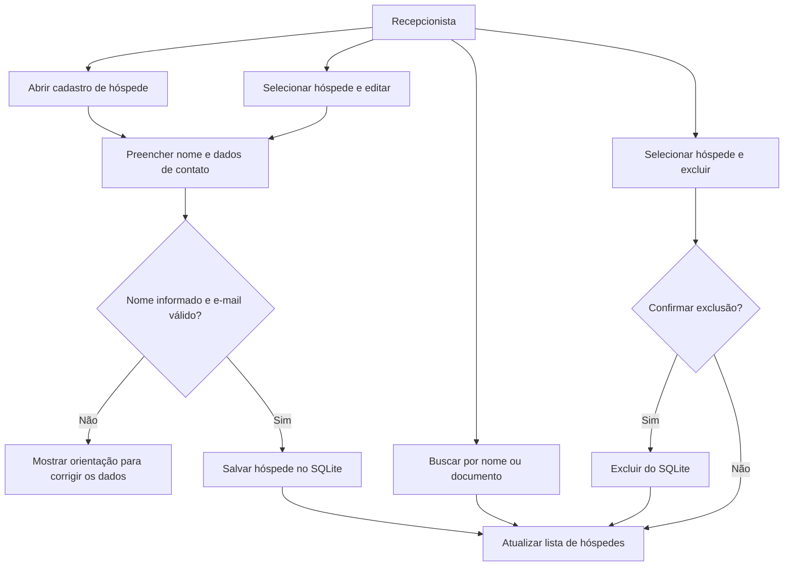

# Fluxo atual de hóspedes

Este diagrama representa as funções que já estão disponíveis na aplicação.

```mermaid
flowchart TD
    A[Recepcionista] --> B[Abrir cadastro de hóspede]
    B --> C[Preencher nome e dados de contato]
    C --> D{Nome informado e e-mail válido?}
    D -- Não --> E[Mostrar orientação para corrigir os dados]
    D -- Sim --> F[Salvar hóspede no SQLite]
    F --> G[Atualizar lista de hóspedes]

    A --> H[Buscar por nome ou documento]
    H --> G
    A --> I[Selecionar hóspede e editar]
    I --> C
    A --> J[Selecionar hóspede e excluir]
    J --> K{Confirmar exclusão?}
    K -- Sim --> L[Excluir do SQLite]
    L --> G
    K -- Não --> G
```
